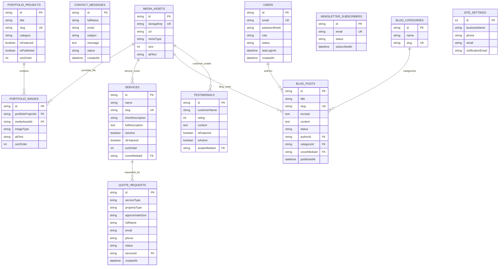

# Neatly - Production Database Specification

---

## 1. DOCUMENT HEADER

* **Project:** Neatly
* **Database Version:** 1.0
* **Database Engine:** PostgreSQL (v15+)
* **ORM:** Prisma ORM (v5+)
* **Status:** Database Definition
* **Source of Truth:**
  * [`docs/PRD.md`](file:///Users/sayamdas/Documents/Programming/Mern%20Stack/My%20Website/Neatly/docs/PRD.md)
  * [`docs/ARCHITECTURE.md`](file:///Users/sayamdas/Documents/Programming/Mern%20Stack/My%20Website/Neatly/docs/ARCHITECTURE.md)
* **Document Purpose:** This document defines the conceptual data model, relational schema layout, entity attributes, indexes, foreign key constraints, migration policies, and privacy boundaries for the Neatly platform.

> **Architectural Premise:** *While [`docs/ARCHITECTURE.md`](file:///Users/sayamdas/Documents/Programming/Mern%20Stack/My%20Website/Neatly/docs/ARCHITECTURE.md) defines the system layers, application flow, and infrastructure components, this Database Specification defines the exact relational data structure, entity models, and storage rules required to execute the business requirements defined in [`docs/PRD.md`](file:///Users/sayamdas/Documents/Programming/Mern%20Stack/My%20Website/Neatly/docs/PRD.md).*

---

## 2. DATABASE PRINCIPLES

1. **PostgreSQL Relational Core:** Use PostgreSQL as the single source of truth for all operational lead data, administrative credentials, CMS content, and global configuration parameters.
2. **Type-Safe ORM Abstraction:** Model all tables and relations using Prisma ORM schemas (`schema.prisma`), enabling end-to-end TypeScript type generation.
3. **Strict Relational Integrity:** Enforce foreign key constraints, unique constraints, and check conditions at the database level to prevent data corruption.
4. **Appropriate Indexing:** Index primary lookup keys, foreign keys, unique slugs, status flags, and timestamp ordering columns to maintain low-latency query performance.
5. **No Direct Client Database Access:** The database must sit behind server boundaries. Client/browser code MUST NEVER directly connect to or execute queries against PostgreSQL.
6. **Server-Side Security & Secret Isolation:** Database connection strings (`DATABASE_URL`) must exist strictly in server environment variables and never be exposed to public web bundles.
7. **Strict Personal Data (PII) Protection:** Customer contact details, addresses, and quote request messages must be protected behind authenticated administrative boundaries.
8. **Version-Controlled Schema Migrations:** All schema changes must be managed through version-controlled Prisma migration scripts (`prisma/migrations/`). Manual production database alterations are strictly prohibited.
9. **Zero Fake Production Data:** Seed data for development must remain strictly isolated from production environments. Production database tables ingest only authentic business content.
10. **Normalized & Pragmatic Modeling:** Maintain a clean 3NF (Third Normal Form) design for relational entities while using structured JSON/array columns for localized, non-queryable lists (e.g., service checklists, working hours).

---

## 3. DOMAIN OVERVIEW & RELATIONSHIP MAP

```text
                               ┌──────────────────┐
                               │     AdminUser    │
                               │  (Auth / Admin)  │
                               └────────┬─────────┘
                                        │
                         manages / authors / moderates
                                        │
        ┌──────────────────┬────────────┴─────┬──────────────────┐
        ▼                  ▼                  ▼                  ▼
  ┌───────────┐    ┌───────────────┐   ┌──────────────┐   ┌─────────────┐
  │  Service  │    │PortfolioProject│   │   BlogPost   │   │ Testimonial │
  └─────┬─────┘    └───────┬───────┘   └──────┬───────┘   └─────────────┘
        │                  │                  │
   associated         contains 1:N        belongs to
        │                  │                  │
        ▼                  ▼                  ▼
  ┌───────────┐    ┌───────────────┐   ┌──────────────┐
  │QuoteRequest│   │PortfolioImage │   │ BlogCategory │
  └───────────┘    └───────┬───────┘   └──────────────┘
                           │
                       references
                           │
                           ▼
                    ┌──────────────┐
                    │  MediaAsset  │
                    └──────────────┘
```

---

## 4. ENTITY LIST

| Entity Name | Database Table Name | Primary Purpose | MVP Scope |
| :--- | :--- | :--- | :--- |
| `User` | `users` | Admin identities, password hashes, and session references | Yes (Single Admin) |
| `Session` | `sessions` | Hashed admin session tokens and expiry timestamps | Yes |
| `PasswordResetToken` | `password_reset_tokens` | Hashed single-use password reset tokens | Yes |
| `Service` | `services` | Cleaning service catalog, package inclusions, and descriptions | Yes |
| `QuoteRequest` | `quote_requests` | Lead capture records from the interactive quote form | Yes |
| `ContactMessage` | `contact_messages` | Inquiries submitted through the general contact form | Yes |
| `PortfolioProject` | `portfolio_projects` | Cleaning project case studies showcasing real work | Yes |
| `PortfolioImage` | `portfolio_images` | Before/After image pairs linked to portfolio projects | Yes |
| `Testimonial` | `testimonials` | Authentic customer reviews and star ratings | Yes |
| `BlogPost` | `blog_posts` | Content marketing articles and news posts | Yes |
| `BlogCategory` | `blog_categories` | Categorization taxonomies for blog articles | Yes |
| `NewsletterSubscriber` | `newsletter_subscribers` | Email marketing subscriber list | Yes |
| `SiteSettings` | `site_settings` | Global business parameters (Phone, address, hours) | Yes (Single Row) |
| `MediaAsset` | `media_assets` | Metadata registry for uploaded image assets | Yes |

---

## 5. USER / ADMIN MODEL (`User`)

Stores administrative user accounts for dashboard access and content authorship.

### 5.1 Attributes

| Field Name | Data Type | Constraints | Description |
| :--- | :--- | :--- | :--- |
| `id` | String (UUID / CUID) | Primary Key, Default: Auto | Unique identifier |
| `name` | String | NOT NULL | Full name of the administrator |
| `email` | String | NOT NULL, UNIQUE | Login email address |
| `passwordHash` | String | NOT NULL | `bcrypt` hashed password string |
| `role` | Enum (`UserRole`) | NOT NULL, Default: `ADMIN` | Role authorization level |
| `status` | Enum (`UserStatus`) | NOT NULL, Default: `ACTIVE` | Account access status |
| `emailVerifiedAt` | DateTime | NULLABLE | Set when an email verification or cleaner invitation token is consumed. Customer registration stores the email immediately and leaves this null until `/verify-email` succeeds. |
| `lastLoginAt` | DateTime | NULLABLE | Timestamp of last successful login |
| `createdAt` | DateTime | NOT NULL, Default: `now()` | Record creation timestamp (UTC) |
| `updatedAt` | DateTime | NOT NULL, UpdatedAt | Record modification timestamp (UTC) |

### 5.2 Roles & Enums
* `UserRole`: `ADMIN` (MVP). Reserved future values: `SUPER_ADMIN`, `CONTENT_MANAGER`, `STAFF`.
* `UserStatus`: `ACTIVE`, `INACTIVE`, `SUSPENDED`.

### 5.3 Session Model (`Session`)

Server-side admin session records. Raw session tokens are never stored. The cookie value is hashed with `HMAC-SHA256(SESSION_SECRET)` before persistence.

| Field Name | Data Type | Constraints | Description |
| :--- | :--- | :--- | :--- |
| `id` | String (CUID) | Primary Key, Default: Auto | Unique identifier |
| `userId` | String | NOT NULL, FK (`User`) | Owning admin user |
| `tokenHash` | String | NOT NULL, UNIQUE | HMAC hash of the session token |
| `expiresAt` | DateTime | NOT NULL | Expiry timestamp (7 days from issue) |
| `createdAt` | DateTime | NOT NULL, Default: `now()` | Record creation timestamp (UTC) |

### 5.4 Password Reset Token (`PasswordResetToken`)

Single-use password reset tokens. Raw tokens are never stored. Tokens expire 60 minutes after issue and are invalidated after a successful reset.

| Field Name | Data Type | Constraints | Description |
| :--- | :--- | :--- | :--- |
| `id` | String (CUID) | Primary Key, Default: Auto | Unique identifier |
| `userId` | String | NOT NULL, FK (`User`) | Owning admin user |
| `tokenHash` | String | NOT NULL, UNIQUE | HMAC hash of the reset token |
| `expiresAt` | DateTime | NOT NULL | Expiry timestamp (60 minutes from issue) |
| `usedAt` | DateTime | NULLABLE | Set when the token is consumed |
| `createdAt` | DateTime | NOT NULL, Default: `now()` | Record creation timestamp (UTC) |

### 5.5 Email Verification Token (`EmailVerificationToken`)

Single-use email verification tokens. Raw tokens are never stored. Admin and customer email verification tokens expire 24 hours after issue. Cleaner invitation tokens reuse this table with a 7-day TTL (`AUTH_CLEANER_INVITATION_TTL_MS`). All are hashed, single-use, and invalidated after successful consumption. There is no separate invitation model. Customer pending verification is `User.emailVerifiedAt = null`, not a separate account-status enum.

| Field Name | Data Type | Constraints | Description |
| :--- | :--- | :--- | :--- |
| `id` | String (CUID) | Primary Key, Default: Auto | Unique identifier |
| `userId` | String | NOT NULL, FK (`User`) | Owning user (admin verification, customer verification, or invited cleaner staff) |
| `tokenHash` | String | NOT NULL, UNIQUE | HMAC hash of the verification or invitation token |
| `expiresAt` | DateTime | NOT NULL | Expiry timestamp (24 hours for admin and customer verification; 7 days for cleaner invitations) |
| `usedAt` | DateTime | NULLABLE | Set when the token is consumed |
| `createdAt` | DateTime | NOT NULL, Default: `now()` | Record creation timestamp (UTC) |

---

## 6. SERVICE MODEL (`Service`)

Stores cleaning packages offered by Neatly, displayed on the public website and editable via the Admin CMS.

### 6.1 Attributes

| Field Name | Data Type | Constraints | Description |
| :--- | :--- | :--- | :--- |
| `id` | String (UUID / CUID) | Primary Key, Default: Auto | Unique identifier |
| `name` | String | NOT NULL | Service title (e.g., "Deep Home Sanitization") |
| `slug` | String | NOT NULL, UNIQUE | URL slug (e.g., `deep-home-sanitization`) |
| `shortDescription` | String | NOT NULL | 1-2 sentence overview for index cards |
| `fullDescription` | Text | NOT NULL | Multi-paragraph scope explanation |
| `benefits` | String[] / JSON | NOT NULL | Array of benefit statements |
| `includedTasks` | JSON | NOT NULL | Structured checklist of standard inclusions |
| `excludedTasks` | String[] / JSON | NULLABLE | List of non-included or add-on scope items |
| `faqs` | JSON | NULLABLE | Array of service-specific Q&A pairs |
| `coverMediaId` | String | NULLABLE, FK (`MediaAsset`) | Optional header image reference |
| `seoTitle` | String | NULLABLE | Custom meta title tag |
| `seoDescription` | String | NULLABLE | Custom meta description tag |
| `isActive` | Boolean | NOT NULL, Default: `true` | Public visibility flag |
| `isFeatured` | Boolean | NOT NULL, Default: `false` | Homepage highlight flag |
| `sortOrder` | Integer | NOT NULL, Default: `0` | Card display order ranking |
| `createdAt` | DateTime | NOT NULL, Default: `now()` | Record creation timestamp (UTC) |
| `updatedAt` | DateTime | NOT NULL, UpdatedAt | Record modification timestamp (UTC) |

---

## 7. QUOTE REQUEST MODEL (`QuoteRequest`)

Captures interactive quote submissions submitted by visitors on `/quote`.

### 7.1 Attributes

| Field Name | Data Type | Constraints | Description |
| :--- | :--- | :--- | :--- |
| `id` | String (UUID / CUID) | Primary Key, Default: Auto | Unique lead identifier |
| `serviceType` | Enum (`QuoteServiceType`) | NOT NULL | Residential, Deep, Move-In/Out, Commercial, Custom |
| `propertyType` | Enum (`QuotePropertyType`)| NOT NULL | House, Apartment, Condo, Office, Commercial Space |
| `approximateSize` | String | NOT NULL | Size range (e.g., "1,000-2,000 sq ft") |
| `bedrooms` | Integer | NULLABLE | Bedroom count (Required for Residential) |
| `bathrooms` | Float | NULLABLE | Bathroom count (Required for Residential) |
| `frequency` | Enum (`QuoteFrequency`) | NOT NULL | One-time, Weekly, Bi-Weekly, Monthly |
| `preferredDate` | DateTime | NOT NULL | Customer requested service date |
| `preferredTime` | String | NOT NULL | Morning, Afternoon, Evening preference |
| `fullName` | String | NOT NULL | Prospect customer name |
| `email` | String | NOT NULL | Prospect customer email |
| `phone` | String | NOT NULL | Prospect customer phone number |
| `serviceAddress` | String | NOT NULL | Property street address or Zip code |
| `additionalNotes` | Text | NULLABLE | Custom customer notes / special requests |
| `serviceId` | String | NULLABLE, FK (`Service`) | Optional direct reference to selected Service entity |
| `status` | Enum (`QuoteStatus`) | NOT NULL, Default: `NEW` | Lead pipeline lifecycle status |
| `quotedAmount` | Decimal(10,2) | NULLABLE | Admin-set quoted price. Required before `QUOTED`. |
| `adminNotes` | Text | NULLABLE | Internal staff notes on estimate/outreach |
| `createdAt` | DateTime | NOT NULL, Default: `now()` | Submission timestamp (UTC) |
| `updatedAt` | DateTime | NOT NULL, UpdatedAt | Status update timestamp (UTC) |

There is no `customerId` on `QuoteRequest`. Public create is anonymous. Authenticated customer reads match `QuoteRequest.email` to the session user's email (indexed). `adminNotes` is staff-only and never returned on customer serializers.

---

## 8. CONTACT MESSAGE MODEL (`ContactMessage`)

Stores general non-quote inquiries submitted on `/contact`.

### 8.1 Attributes

| Field Name | Data Type | Constraints | Description |
| :--- | :--- | :--- | :--- |
| `id` | String (UUID / CUID) | Primary Key, Default: Auto | Unique message identifier |
| `fullName` | String | NOT NULL | Sender full name |
| `email` | String | NOT NULL | Sender email address |
| `phone` | String | NULLABLE | Optional contact phone number |
| `subject` | String | NOT NULL | Inquiry subject title |
| `message` | Text | NOT NULL | Detailed message body |
| `status` | Enum (`ContactStatus`) | NOT NULL, Default: `NEW` | Processing status |
| `adminNotes` | Text | NULLABLE | Internal follow-up notes |
| `createdAt` | DateTime | NOT NULL, Default: `now()` | Submission timestamp (UTC) |
| `updatedAt` | DateTime | NOT NULL, UpdatedAt | Status update timestamp (UTC) |

---

## 9. PORTFOLIO PROJECT MODEL (`PortfolioProject`)

Represents a real completed cleaning project case study.

### 9.1 Attributes

| Field Name | Data Type | Constraints | Description |
| :--- | :--- | :--- | :--- |
| `id` | String (UUID / CUID) | Primary Key, Default: Auto | Unique project identifier |
| `title` | String | NOT NULL | Project title (e.g., "Downtown Loft Deep Clean") |
| `slug` | String | NOT NULL, UNIQUE | URL slug |
| `category` | Enum (`ServiceCategory`)| NOT NULL | Residential, Deep Clean, Commercial, Move-Out |
| `description` | Text | NOT NULL | Project background and cleaning outcome |
| `location` | String | NULLABLE | General area/neighborhood (e.g., "North Suburbs") |
| `isFeatured` | Boolean | NOT NULL, Default: `false` | Homepage showcase flag |
| `isPublished` | Boolean | NOT NULL, Default: `true` | Public visibility flag |
| `sortOrder` | Integer | NOT NULL, Default: `0` | Showcase ordering rank |
| `createdAt` | DateTime | NOT NULL, Default: `now()` | Record creation timestamp (UTC) |
| `updatedAt` | DateTime | NOT NULL, UpdatedAt | Record modification timestamp (UTC) |

---

## 10. PORTFOLIO IMAGE MODEL (`PortfolioImage`)

Links before/after image pairs to a `PortfolioProject`.

### 10.1 Attributes

| Field Name | Data Type | Constraints | Description |
| :--- | :--- | :--- | :--- |
| `id` | String (UUID / CUID) | Primary Key, Default: Auto | Unique image record identifier |
| `portfolioProjectId`| String | NOT NULL, FK (`PortfolioProject`)| Parent project reference |
| `mediaAssetId` | String | NOT NULL, FK (`MediaAsset`) | Referenced media file |
| `imageType` | Enum (`PortfolioImageType`)| NOT NULL | `BEFORE`, `AFTER`, `GALLERY` |
| `altText` | String | NOT NULL | Accessibility and SEO alt description |
| `sortOrder` | Integer | NOT NULL, Default: `0` | Order within project gallery |
| `createdAt` | DateTime | NOT NULL, Default: `now()` | Upload timestamp (UTC) |

---

## 11. TESTIMONIAL MODEL (`Testimonial`)

Stores authentic customer feedback and ratings.

### 11.1 Attributes

| Field Name | Data Type | Constraints | Description |
| :--- | :--- | :--- | :--- |
| `id` | String (UUID / CUID) | Primary Key, Default: Auto | Unique review identifier |
| `customerId` | String | NULLABLE, FK (`Customer`) | Session customer who submitted a booking review |
| `bookingId` | String | NULLABLE, UNIQUE, FK (`Booking`) | Completed booking this review belongs to |
| `customerName` | String | NOT NULL | Customer name (e.g., "Sarah M.") |
| `customerRole` | String | NULLABLE | Location or context (e.g., "Homeowner in Westside") |
| `rating` | Integer | NOT NULL, Default: `5` | Star rating (Range: 1 to 5) |
| `content` | Text | NOT NULL | Written review text |
| `avatarMediaId` | String | NULLABLE, FK (`MediaAsset`) | Optional customer headshot |
| `serviceCategory` | Enum (`ServiceCategory`)| NULLABLE | Category of service rendered |
| `isFeatured` | Boolean | NOT NULL, Default: `false` | Homepage highlight flag |
| `isActive` | Boolean | NOT NULL, Default: `true` | Public visibility flag |
| `sortOrder` | Integer | NOT NULL, Default: `0` | Display rank |
| `createdAt` | DateTime | NOT NULL, Default: `now()` | Creation timestamp (UTC) |
| `updatedAt` | DateTime | NOT NULL, UpdatedAt | Modification timestamp (UTC) |

---

## 12. BLOG POST MODEL (`BlogPost`)

Stores content marketing articles managed via Admin CMS.

### 12.1 Attributes

| Field Name | Data Type | Constraints | Description |
| :--- | :--- | :--- | :--- |
| `id` | String (UUID / CUID) | Primary Key, Default: Auto | Unique article identifier |
| `title` | String | NOT NULL | Article headline |
| `slug` | String | NOT NULL, UNIQUE | SEO URL slug |
| `excerpt` | Text | NOT NULL | Short summary for list views |
| `content` | Text | NOT NULL | Rich text / Markdown body |
| `coverMediaId` | String | NULLABLE, FK (`MediaAsset`) | Featured header image |
| `authorId` | String | NOT NULL, FK (`User`) | Author admin user reference |
| `categoryId` | String | NULLABLE, FK (`BlogCategory`)| Associated category taxonomy |
| `tags` | String[] | NULLABLE | Keyword tags array |
| `status` | Enum (`BlogStatus`) | NOT NULL, Default: `DRAFT` | `DRAFT`, `PUBLISHED`, `ARCHIVED` |
| `publishedAt` | DateTime | NULLABLE | Publication timestamp |
| `seoTitle` | String | NULLABLE | Custom meta title tag |
| `seoDescription` | String | NULLABLE | Custom meta description tag |
| `createdAt` | DateTime | NOT NULL, Default: `now()` | Creation timestamp (UTC) |
| `updatedAt` | DateTime | NOT NULL, UpdatedAt | Modification timestamp (UTC) |

---

## 13. BLOG CATEGORY MODEL (`BlogCategory`)

Taxonomy table for categorizing blog posts.

### 13.1 Attributes

| Field Name | Data Type | Constraints | Description |
| :--- | :--- | :--- | :--- |
| `id` | String (UUID / CUID) | Primary Key, Default: Auto | Unique category identifier |
| `name` | String | NOT NULL | Category display name (e.g., "Home Care") |
| `slug` | String | NOT NULL, UNIQUE | URL slug |
| `description` | String | NULLABLE | Category description |
| `createdAt` | DateTime | NOT NULL, Default: `now()` | Creation timestamp (UTC) |
| `updatedAt` | DateTime | NOT NULL, UpdatedAt | Modification timestamp (UTC) |

---

## 14. NEWSLETTER SUBSCRIBER MODEL (`NewsletterSubscriber`)

Stores email addresses captured for top-of-funnel marketing updates.

### 14.1 Attributes

| Field Name | Data Type | Constraints | Description |
| :--- | :--- | :--- | :--- |
| `id` | String (UUID / CUID) | Primary Key, Default: Auto | Unique subscriber identifier |
| `email` | String | NOT NULL, UNIQUE | Subscriber email address |
| `status` | Enum (`NewsletterStatus`)| NOT NULL, Default: `SUBSCRIBED`| `SUBSCRIBED`, `UNSUBSCRIBED` |
| `subscribedAt` | DateTime | NOT NULL, Default: `now()` | Initial subscription timestamp |
| `unsubscribedAt`| DateTime | NULLABLE | Unsubscribe timestamp |
| `createdAt` | DateTime | NOT NULL, Default: `now()` | Record creation timestamp (UTC) |
| `updatedAt` | DateTime | NOT NULL, UpdatedAt | Record modification timestamp (UTC) |

---

## 15. SITE SETTINGS MODEL (`SiteSettings`)

Singleton configuration table for global business contact parameters and default metadata.

### 15.1 Attributes

| Field Name | Data Type | Constraints | Description |
| :--- | :--- | :--- | :--- |
| `id` | Integer | Primary Key, Default: `1` | Singleton row enforcer (`CHECK (id = 1)`) |
| `businessName` | String | NOT NULL, Default: "Neatly" | Public business name |
| `tagline` | String | NOT NULL, Default: "Clean, minimal, high-trust" | Brand tagline |
| `phone` | String | NOT NULL | Public contact phone number |
| `email` | String | NOT NULL | Public customer support email |
| `address` | String | NOT NULL | Physical office or service area address |
| `workingHours` | JSON | NOT NULL | Operating hours structure |
| `serviceAreas` | String[] | NOT NULL | Array of covered cities/zip codes |
| `socialLinks` | JSON | NULLABLE | Social media profile URLs |
| `notificationEmail`| String | NOT NULL | Admin alert email recipient address |
| `defaultSeoTitle` | String | NOT NULL | Fallback page title |
| `defaultSeoDesc` | String | NOT NULL | Fallback meta description |
| `updatedAt` | DateTime | NOT NULL, UpdatedAt | Configuration last modified timestamp |

---

## 16. MEDIA ASSET MODEL (`MediaAsset`)

Central registry tracking uploaded image assets stored in cloud object storage.

### 16.1 Attributes

| Field Name | Data Type | Constraints | Description |
| :--- | :--- | :--- | :--- |
| `id` | String (UUID / CUID) | Primary Key, Default: Auto | Unique asset identifier |
| `storageKey` | String | NOT NULL, UNIQUE | Cloud storage provider file key/public ID |
| `url` | String | NOT NULL | Public HTTP delivery URL |
| `filename` | String | NOT NULL | Original uploaded filename |
| `mimeType` | String | NOT NULL | `image/jpeg`, `image/png`, `image/webp` |
| `size` | Integer | NOT NULL | File size in bytes (Max: 5,242,880) |
| `width` | Integer | NULLABLE | Image width in pixels |
| `height` | Integer | NULLABLE | Image height in pixels |
| `altText` | String | NOT NULL | Default accessibility alt text |
| `createdAt` | DateTime | NOT NULL, Default: `now()` | Upload timestamp (UTC) |
| `updatedAt` | DateTime | NOT NULL, UpdatedAt | Modification timestamp (UTC) |

---

## 17. RELATIONSHIP MAP & FOREIGN KEYS

| Source Entity | Relationship | Target Entity | Foreign Key Column | Delete Cascade Policy |
| :--- | :--- | :--- | :--- | :--- |
| `QuoteRequest` | Many-to-One (Optional)| `Service` | `serviceId` | `SET NULL` |
| `PortfolioImage` | Many-to-One | `PortfolioProject` | `portfolioProjectId` | `CASCADE` |
| `PortfolioImage` | Many-to-One | `MediaAsset` | `mediaAssetId` | `RESTRICT` |
| `BlogPost` | Many-to-One | `User` (Author) | `authorId` | `RESTRICT` |
| `Session` | Many-to-One | `User` | `userId` | `CASCADE` |
| `PasswordResetToken` | Many-to-One | `User` | `userId` | `CASCADE` |
| `BlogPost` | Many-to-One (Optional)| `BlogCategory` | `categoryId` | `SET NULL` |
| `BlogPost` | Many-to-One (Optional)| `MediaAsset` | `coverMediaId` | `SET NULL` |
| `Service` | Many-to-One (Optional)| `MediaAsset` | `coverMediaId` | `SET NULL` |
| `Testimonial` | Many-to-One (Optional)| `MediaAsset` | `avatarMediaId` | `SET NULL` |
| `Testimonial` | Many-to-One (Optional)| `Customer` | `customerId` | `RESTRICT` |
| `Testimonial` | One-to-One (Optional)| `Booking` | `bookingId` | `RESTRICT` |

---

## 18. ENTITY RELATIONSHIP DIAGRAM (MERMAID ERD)



---

## 19. DATABASE ENUMS SPECIFICATION

### 19.1 `UserRole`
* `ADMIN`: Standard system administrator with complete dashboard permissions.

### 19.2 `UserStatus`
* `ACTIVE`: Normal operating state allowing login.
* `INACTIVE`: Temporarily disabled state.
* `SUSPENDED`: Access blocked.

### 19.3 `ServiceCategory`
* `RESIDENTIAL`: Ongoing domestic home maintenance.
* `DEEP_CLEAN`: Intensive detail cleaning.
* `MOVE_IN_OUT`: Transition cleaning for real estate turnovers.
* `COMMERCIAL`: Office and commercial space maintenance.

### 19.4 `QuoteServiceType`
* `RESIDENTIAL`, `DEEP_CLEAN`, `MOVE_IN_OUT`, `COMMERCIAL`, `CUSTOM`.

### 19.5 `QuotePropertyType`
* `HOUSE`, `APARTMENT`, `CONDO`, `OFFICE`, `COMMERCIAL_SPACE`.

### 19.6 `QuoteFrequency`
* `ONE_TIME`, `WEEKLY`, `BI_WEEKLY`, `MONTHLY`.

### 19.7 `QuoteStatus`
* `NEW`: Fresh request submitted; pending initial admin review.
* `REVIEWING`: Admin currently evaluating scope/pricing.
* `CONTACTED`: Customer reached via phone or email.
* `QUOTED`: Price estimate delivered to prospect.
* `ACCEPTED`: Customer accepted the quoted amount; booking is now allowed.
* `CONVERTED`: Lead won; service scheduled.
* `DECLINED`: Quote rejected by prospect.
* `CLOSED`: Stale lead archived.

### 19.8 `ContactStatus`
* `NEW`: Unread message in inbox.
* `READ`: Viewed by admin.
* `RESPONDED`: Admin follow-up completed.
* `ARCHIVED`: Archived message.

### 19.9 `BlogStatus`
* `DRAFT`: Unpublished draft.
* `PUBLISHED`: Live on public blog.
* `ARCHIVED`: Hidden from index views.

### 19.10 `NewsletterStatus`
* `SUBSCRIBED`: Active subscriber.
* `UNSUBSCRIBED`: Opted out.

### 19.11 `PortfolioImageType`
* `BEFORE`: Pre-cleaning photo.
* `AFTER`: Post-cleaning photo.
* `GALLERY`: General showcase photo.

---

## 20. INDEXING STRATEGY

To preserve query latency targets (< 15ms database responses), explicit indexes are defined:

```text
-- Index Strategy Definitions
User:
  - UNIQUE INDEX (email)

Session:
  - UNIQUE INDEX (tokenHash)
  - INDEX (userId)
  - INDEX (expiresAt)

PasswordResetToken:
  - UNIQUE INDEX (tokenHash)
  - INDEX (userId)
  - INDEX (expiresAt)

Service:
  - UNIQUE INDEX (slug)
  - INDEX (isActive, sortOrder)

QuoteRequest:
  - INDEX (status, createdAt DESC)
  - INDEX (serviceId)
  - INDEX (email)

ContactMessage:
  - INDEX (status, createdAt DESC)

PortfolioProject:
  - UNIQUE INDEX (slug)
  - INDEX (isPublished, isFeatured, sortOrder)

PortfolioImage:
  - INDEX (portfolioProjectId, sortOrder)

BlogPost:
  - UNIQUE INDEX (slug)
  - INDEX (status, publishedAt DESC)
  - INDEX (categoryId)

NewsletterSubscriber:
  - UNIQUE INDEX (email)
  - INDEX (status)

MediaAsset:
  - UNIQUE INDEX (storageKey)
```

---

## 21. UNIQUE CONSTRAINTS

The database strictly enforces uniqueness across six business columns:
1. `User.email`: Prevents duplicate admin accounts.
2. `Service.slug`: Guarantees unique routing for `/services/[slug]`.
3. `PortfolioProject.slug`: Guarantees unique portfolio identifiers.
4. `BlogPost.slug`: Guarantees unique routing for `/blog/[slug]`.
5. `BlogCategory.slug`: Prevents category taxonomy collision.
6. `NewsletterSubscriber.email`: Prevents duplicate email marketing subscriptions.
7. `MediaAsset.storageKey`: Prevents duplicate storage asset references.
8. `SiteSettings.id`: Enforces singleton settings pattern (ID must equal 1).
9. `Session.tokenHash`: Prevents duplicate session token hashes.
10. `PasswordResetToken.tokenHash`: Prevents duplicate reset token hashes.

---

## 22. FOREIGN KEY INTEGRITY & DELETION RULES

* **Protected Deletions (`RESTRICT`):** Deleting an Admin `User` who authored blog posts is RESTRICTED to prevent orphaned articles. Deleting a `MediaAsset` linked to an active `PortfolioImage` is RESTRICTED.
* **Safe Nullification (`SET NULL`):** Deleting a `Service` sets `serviceId` on associated `QuoteRequest` records to `NULL`, retaining historical lead data without breaking relational constraints. Deleting a `BlogCategory` sets `categoryId` on `BlogPost` records to `NULL`.
* **Cascading Deletions (`CASCADE`):** Deleting a `PortfolioProject` automatically cascades to delete associated `PortfolioImage` record rows (media files remain protected in object storage until audited).

---

## 23. SOFT DELETE VS. HARD DELETE POLICY

* **Lead & Inquiries (`QuoteRequest`, `ContactMessage`):** Hard deletion is strictly prohibited. Records transition through explicit lifecycle status enums (`CLOSED`, `ARCHIVED`) to maintain auditability.
* **Content Catalog (`Service`, `PortfolioProject`, `Testimonial`, `BlogPost`):** Managed via active/published Boolean flags (`isActive`, `isPublished`, `status = DRAFT|ARCHIVED`). Unpublishing removes items from public queries without destroying historical database entries. Hard deletion is reserved for admin purging.

---

## 24. AUDITABILITY SPECIFICATION

For the MVP, lightweight auditability is maintained directly within lead records:
* `QuoteRequest.status`: Tracks current lead status.
* `QuoteRequest.adminNotes`: Appends timestamped staff review notes.
* `QuoteRequest.updatedAt`: Logs exact timestamp of last status modification.

---

## 25. TIMESTAMP CONVENTIONS

* **Storage Format:** All timestamp columns (`createdAt`, `updatedAt`, `publishedAt`, `subscribedAt`) are stored strictly in **UTC** as PostgreSQL `TIMESTAMP WITH TIME ZONE` (TIMESTAMPTZ).
* **Client Local Formatting:** Timezone formatting is executed purely in UI presentation components using standard date utilities.

---

## 26. DATA VALIDATION LAYERING

```text
1. Client UI Form          -> React Hook Form inline feedback
   ↓
2. Server API Boundary     -> Zod Schema validation (rejects invalid payloads)
   ↓
3. Prisma Service Layer    -> Type check & Business logic validation
   ↓
4. PostgreSQL Engine       -> Strict DB Constraints (NOT NULL, UNIQUE, FK, ENUM)
```

---

## 27. PRIVACY & PERSONAL DATA PROTECTION (PII)

* **PII Inventory:** Customer full names, email addresses, phone numbers, and physical property addresses stored in `QuoteRequest` and `ContactMessage`.
* **Access Boundary:** PII data is restricted to authenticated Admin users (`/admin/quotes`, `/admin/contacts`). Public API endpoints MUST NEVER return quote or contact records.

---

## 28. DATA RETENTION POLICY

| Data Type | Retention Policy | Disposal Action |
| :--- | :--- | :--- |
| **Quote Requests** | Retained for 24 months for sales analytics | Archive status or manual purge |
| **Contact Messages** | Retained for 12 months post-response | Archive status or manual purge |
| **Newsletter Subscribers**| Retained indefinitely until unsubscribed | Immediate status update to `UNSUBSCRIBED` |
| **CMS Content** | Retained indefinitely | Admin hard delete |

---

## 29. SEEDING STRATEGY

### 29.1 Development Seed Script (`prisma/seed.ts`)
* **Default Admin User:** Creates standard dev admin (`admin@neatly.local`) with securely hashed dummy password.
* **Sample Services:** Seeds the five PRD default categories (Residential, Deep, Move-In/Out, Commercial, Recurring) with matching local cover stills. Existing non-seeded catalog rows are left in place.
* **Sample Site Settings:** Seeds singleton `SiteSettings` row (`id=1`) with `[Development Placeholder]` phone, email, and address. Never run this in production.
* **Sample Media:** Upserts 14 local `MediaAsset` rows (`seed/cms/*` keys) pointing at `/images/...` stills for blog covers, portfolio frames, and inactive review avatars.
* **Sample Blog Categories:** Upserts 10 development categories (`dev-home-care` … `dev-seasonal`).
* **Sample Blog Posts:** Upserts 10 journal posts (6 `PUBLISHED`, 3 `DRAFT`, 1 `ARCHIVED`) tagged `development-placeholder`.
* **Sample Newsletter Subscribers:** Upserts 10 `dev-subscriber-NN@example.test` rows (8 `SUBSCRIBED`, 2 `UNSUBSCRIBED`).
* **Sample Portfolio:** Upserts 10 `dev-*` projects (3 featured) and two `PortfolioImage` rows each (BEFORE + AFTER).
* **Sample Testimonials:** Upserts 10 `[Development Placeholder]` reviews with `isActive: true` so labeled development quotes can appear on `/` and `/testimonials`. Names stay prefixed; they are not invented as real customers.

*Constraint: The development seed script MUST NEVER be executed in production environments.*

---

## 30. MIGRATION & DEPLOYMENT STRATEGY

```text
Local Schema Changes (prisma/schema.prisma)
       │
       ▼
Generate & Test Migration Locally (`npx prisma migrate dev --name init_schema`)
       │
       ▼
Commit Migration File Set to Git Version Control
       │
       ▼
CI Pipeline Execution (`npx prisma validate`)
       │
       ▼
Automated Production Migration Execution (`npx prisma migrate deploy`)
```

---

## 31. BACKUP & RECOVERY REQUIREMENTS

* **Automated Daily Backups:** Production PostgreSQL database backed up automatically once every 24 hours.
* **Retention Window:** Daily backup snapshots retained for a minimum of 30 days.
* **Point-in-Time Recovery (PITR):** Production database host configured to support point-in-time recovery to within 5 minutes of data failure.

---

## 32. DATABASE SECURITY CONTROLS

* **Network Isolation:** PostgreSQL instance accessible only via encrypted connections (SSL/TLS `require` mode).
* **Connection Pooling:** Prisma Client initialized using a single connection pooler instance to prevent database connection exhaustion.
* **Zero Client Credentials:** DB connection string (`DATABASE_URL`) stored strictly as a server-side environment secret.

---

## 33. QUERY & PERFORMANCE GUIDELINES

1. **Avoid N+1 Queries:** Utilize Prisma `include` and `select` clauses to fetch relational data in unified queries.
2. **Explicit Column Selection:** Public APIs must use Prisma `select` blocks to fetch only required fields, preventing accidental exposure of internal fields or PII.
3. **Paginate Large Datasets:** Admin lists (Quote pipeline, Contact inbox, Blog index) MUST use offset/limit or cursor pagination (default: 20 records per page).

---

## 34. PUBLIC VS. PRIVATE DATA ACCESS MATRIX

| Entity | Public Access Permission | Admin Access Permission |
| :--- | :--- | :--- |
| `User` | ❌ None | 🔒 Full Read/Write |
| `Service` | 🌐 Read (where `isActive = true`) | 🔒 Full Read/Write/Delete |
| `QuoteRequest` | 📝 Create Only (Submit form) | 🔒 Full Read/Write/Status Update |
| `ContactMessage` | 📝 Create Only (Submit form) | 🔒 Full Read/Write/Archive |
| `PortfolioProject` | 🌐 Read (where `isPublished = true`) | 🔒 Full Read/Write/Delete |
| `PortfolioImage` | 🌐 Read (via parent project) | 🔒 Full Read/Write/Delete |
| `Testimonial` | 🌐 Read (where `isActive = true`) | 🔒 Full Read/Write/Delete |
| `BlogPost` | 🌐 Read (where `status = PUBLISHED`)| 🔒 Full Read/Write/Delete |
| `BlogCategory` | 🌐 Read | 🔒 Full Read/Write/Delete |
| `NewsletterSubscriber`| 📝 Create Only (Subscribe input) | 🔒 Full Read / Export CSV |
| `SiteSettings` | 🌐 Selected Public Fields | 🔒 Full Read/Write |
| `MediaAsset` | 🌐 Public URL Delivery | 🔒 Full Upload/Delete |

---

## 35. END-TO-END DATA FLOW EXAMPLES

### 35.1 Flow 1: Quote Lead Storage

```text
Visitor submits /quote form
       │
Zod API Payload Validation
       │
Prisma Operation:
  prisma.quoteRequest.create({
    data: {
      serviceType: "RESIDENTIAL",
      propertyType: "HOUSE",
      approximateSize: "1,000-2,000 sq ft",
      bedrooms: 3,
      bathrooms: 2.0,
      frequency: "BI_WEEKLY",
      preferredDate: new Date("2026-09-01"),
      preferredTime: "Morning (8am-12pm)",
      fullName: "Jane Doe",
      email: "jane@example.com",
      phone: "555-0199",
      serviceAddress: "123 Maple St",
      status: "NEW"
    }
  })
       │
PostgreSQL Inserts Row into `quote_requests` table
```

---

## 36. DEFINITION OF DONE — DATABASE SPECIFICATION

The database design is complete and validated when:
- [x] All PRD MVP entities are fully represented with clear attribute specifications.
- [x] Prisma ORM data types and PostgreSQL constraints are defined.
- [x] Primary keys, unique constraints, and foreign key policies are documented.
- [x] All required enums (QuoteStatus, UserRole, ServiceCategory) are specified.
- [x] Indexes for lookup columns and query ordering are established.
- [x] Mermaid Entity-Relationship Diagram matches the written models 100%.
- [x] Public vs. Private data access matrix is clearly specified.
- [x] Zero unnecessary SaaS database entities are introduced.
